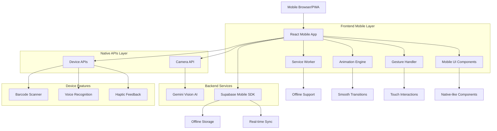

# Arquitetura Técnica - Mobile Native App

## Sistema de Gestão Financeira Mobile-First

## 1. Architecture Design



## 2. Technology Description

* **Frontend**: React\@18 + TypeScript + Vite + PWA

* **Mobile UI**: Framer Motion + React Spring + Tailwind CSS + Headless UI

* **Gestures**: @use-gesture/react + React Touch Events

* **Camera/Scanner**: @zxing/library + MediaDevices API

* **Offline**: Workbox + IndexedDB + React Query

* **Performance**: React.lazy + Intersection Observer + Web Workers

* **Backend**: Supabase (PostgreSQL + Real-time + Storage + Auth)

* **AI Integration**: Google Gemini Vision API

## 3. Route Definitions

| Route          | Purpose                                       | Mobile Optimizations                                  |
| -------------- | --------------------------------------------- | ----------------------------------------------------- |
| /              | Dashboard mobile com cards e navegação bottom | Gestos swipe, pull-to-refresh, cards touch-friendly   |
| /servicos      | Lista de serviços mobile-optimized            | Virtual scrolling, swipe actions, busca por voz       |
| /servicos/novo | Formulário mobile com validação real-time     | Teclado adaptativo, auto-complete, camera integration |
| /servicos/:id  | Detalhes do serviço com ações rápidas         | Swipe navigation, floating actions, share native      |
| /pecas         | Gestão de peças com scanner integrado         | Barcode scanner, image analysis, drag & drop          |
| /pecas/nova    | Registro de peças com IA                      | Camera capture, AI analysis, batch processing         |
| /relatorios    | Relatórios com gráficos interativos           | Touch gestures, zoom/pan, export native               |
| /perfil        | Configurações e sincronização                 | Native toggles, biometric auth, sync status           |

## 4. Mobile Components Architecture

### 4.1 Core Mobile Components

**Layout Components**

```typescript
// MobileLayout.tsx - Layout principal mobile
interface MobileLayoutProps {
  children: React.ReactNode;
  showBottomNav?: boolean;
  showHeader?: boolean;
  backgroundColor?: string;
}

// BottomNavigation.tsx - Navegação inferior nativa
interface BottomNavProps {
  activeTab: string;
  onTabChange: (tab: string) => void;
  badges?: Record<string, number>;
}

// MobileHeader.tsx - Header com ações contextuais
interface MobileHeaderProps {
  title: string;
  showBack?: boolean;
  actions?: HeaderAction[];
  onBack?: () => void;
}
```

**Interaction Components**

```typescript
// SwipeableList.tsx - Lista com swipe actions
interface SwipeableListProps<T> {
  items: T[];
  renderItem: (item: T) => React.ReactNode;
  leftActions?: SwipeAction[];
  rightActions?: SwipeAction[];
  onRefresh?: () => Promise<void>;
}

// TouchableCard.tsx - Card com feedback haptic
interface TouchableCardProps {
  children: React.ReactNode;
  onPress?: () => void;
  onLongPress?: () => void;
  hapticFeedback?: 'light' | 'medium' | 'heavy';
}

// FloatingActionButton.tsx - FAB com animações
interface FABProps {
  icon: React.ReactNode;
  onPress: () => void;
  position?: 'bottom-right' | 'bottom-center';
  extended?: boolean;
  label?: string;
}
```

### 4.2 Animation System

**Transition Components**

```typescript
// PageTransition.tsx - Transições entre páginas
interface PageTransitionProps {
  children: React.ReactNode;
  direction: 'slide-left' | 'slide-right' | 'fade' | 'scale';
  duration?: number;
}

// MicroInteractions.tsx - Micro-interações
interface MicroInteractionProps {
  type: 'button-press' | 'card-tap' | 'list-item-select';
  children: React.ReactNode;
  disabled?: boolean;
}
```

### 4.3 Gesture System

**Gesture Handlers**

```typescript
// GestureProvider.tsx - Contexto de gestos
interface GestureContextType {
  enableSwipeBack: boolean;
  enablePullToRefresh: boolean;
  hapticEnabled: boolean;
}

// SwipeGesture.tsx - Gestos de swipe
interface SwipeGestureProps {
  onSwipeLeft?: () => void;
  onSwipeRight?: () => void;
  onSwipeUp?: () => void;
  onSwipeDown?: () => void;
  threshold?: number;
}
```

## 5. Performance Optimization Strategy

### 5.1 Code Splitting & Lazy Loading

```typescript
// Lazy loading de páginas
const Dashboard = lazy(() => import('./pages/Dashboard'));
const Servicos = lazy(() => import('./pages/Servicos'));
const Pecas = lazy(() => import('./pages/Pecas'));

// Component-level splitting
const ExpensiveChart = lazy(() => import('./components/ExpensiveChart'));

// Route-based splitting
const routes = [
  {
    path: '/',
    component: lazy(() => import('./pages/Dashboard')),
    preload: true
  }
];
```

### 5.2 Virtual Scrolling & Infinite Loading

```typescript
// VirtualList.tsx - Lista virtualizada
interface VirtualListProps<T> {
  items: T[];
  itemHeight: number;
  renderItem: (item: T, index: number) => React.ReactNode;
  onEndReached?: () => void;
  endReachedThreshold?: number;
}

// InfiniteScroll.tsx - Scroll infinito
interface InfiniteScrollProps {
  hasMore: boolean;
  loadMore: () => Promise<void>;
  loader?: React.ReactNode;
  threshold?: number;
}
```

### 5.3 Image Optimization

```typescript
// OptimizedImage.tsx - Imagens otimizadas
interface OptimizedImageProps {
  src: string;
  alt: string;
  width?: number;
  height?: number;
  lazy?: boolean;
  placeholder?: 'blur' | 'skeleton';
}

// ImageCache.ts - Cache de imagens
class ImageCache {
  private cache = new Map<string, Blob>();
  
  async getImage(url: string): Promise<string> {
    // Implementação de cache com IndexedDB
  }
}
```

## 6. Offline & Sync Strategy

### 6.1 Service Worker Configuration

```typescript
// sw.ts - Service Worker para PWA
const CACHE_NAME = 'financeiro-app-v1';
const STATIC_ASSETS = [
  '/',
  '/static/js/bundle.js',
  '/static/css/main.css',
  '/manifest.json'
];

// Estratégias de cache
const cacheStrategies = {
  static: 'cache-first',
  api: 'network-first',
  images: 'cache-first'
};
```

### 6.2 Offline Data Management

```typescript
// OfflineManager.ts - Gerenciamento offline
interface OfflineManager {
  syncQueue: SyncOperation[];
  isOnline: boolean;
  
  queueOperation(operation: SyncOperation): void;
  processSyncQueue(): Promise<void>;
  handleConflicts(conflicts: DataConflict[]): void;
}

// SyncService.ts - Sincronização automática
class SyncService {
  private supabase: SupabaseClient;
  private offlineStorage: IDBDatabase;
  
  async syncData(): Promise<SyncResult> {
    // Implementação de sincronização bidirecional
  }
}
```

## 7. Native Device Integration

### 7.1 Camera & Scanner APIs

```typescript
// CameraService.ts - Integração com câmera
interface CameraService {
  captureImage(): Promise<File>;
  scanBarcode(): Promise<string>;
  analyzeImage(image: File): Promise<AnalysisResult>;
}

// BarcodeScanner.tsx - Scanner de código de barras
interface BarcodeScannerProps {
  onScan: (code: string) => void;
  onError: (error: Error) => void;
  formats?: BarcodeFormat[];
}
```

### 7.2 Haptic Feedback

```typescript
// HapticService.ts - Feedback haptic
class HapticService {
  static light(): void {
    if ('vibrate' in navigator) {
      navigator.vibrate(10);
    }
  }
  
  static medium(): void {
    if ('vibrate' in navigator) {
      navigator.vibrate(20);
    }
  }
  
  static heavy(): void {
    if ('vibrate' in navigator) {
      navigator.vibrate([30, 10, 30]);
    }
  }
}
```

### 7.3 Voice Recognition

```typescript
// VoiceService.ts - Reconhecimento de voz
interface VoiceService {
  startListening(): Promise<void>;
  stopListening(): void;
  onResult: (text: string) => void;
  onError: (error: Error) => void;
}

// VoiceSearch.tsx - Busca por voz
interface VoiceSearchProps {
  onResult: (query: string) => void;
  placeholder?: string;
  language?: string;
}
```

## 8. Data Model Mobile Extensions

### 8.1 Offline Storage Schema

```sql
-- Tabela de sincronização offline
CREATE TABLE sync_queue (
    id UUID PRIMARY KEY DEFAULT gen_random_uuid(),
    operation_type VARCHAR(20) NOT NULL, -- 'CREATE', 'UPDATE', 'DELETE'
    table_name VARCHAR(50) NOT NULL,
    record_id UUID,
    data JSONB,
    timestamp TIMESTAMP WITH TIME ZONE DEFAULT NOW(),
    synced BOOLEAN DEFAULT FALSE,
    retry_count INTEGER DEFAULT 0
);

-- Índices para performance
CREATE INDEX idx_sync_queue_synced ON sync_queue(synced);
CREATE INDEX idx_sync_queue_timestamp ON sync_queue(timestamp);
CREATE INDEX idx_sync_queue_table ON sync_queue(table_name);
```

### 8.2 Mobile-Specific Columns

```sql
-- Adicionar colunas mobile às tabelas existentes
ALTER TABLE servicos ADD COLUMN 
    mobile_data JSONB DEFAULT '{}',
    last_sync TIMESTAMP WITH TIME ZONE DEFAULT NOW(),
    offline_created BOOLEAN DEFAULT FALSE;

ALTER TABLE pecas ADD COLUMN 
    mobile_data JSONB DEFAULT '{}',
    last_sync TIMESTAMP WITH TIME ZONE DEFAULT NOW(),
    offline_created BOOLEAN DEFAULT FALSE;

-- Índices para sincronização
CREATE INDEX idx_servicos_last_sync ON servicos(last_sync);
CREATE INDEX idx_pecas_last_sync ON pecas(last_sync);
```

## 9. Testing & Validation Strategy

### 9.1 Performance Testing

```typescript
// PerformanceMonitor.ts - Monitoramento de performance
class PerformanceMonitor {
  static measureFPS(): number {
    // Implementação de medição de FPS
  }
  
  static measureLoadTime(pageName: string): void {
    // Medição de tempo de carregamento
  }
  
  static trackUserInteraction(action: string): void {
    // Tracking de interações do usuário
  }
}
```

### 9.2 Device Testing Configuration

```typescript
// DeviceTestConfig.ts - Configuração para testes
interface DeviceTestConfig {
  devices: {
    name: string;
    viewport: { width: number; height: number };
    userAgent: string;
    pixelRatio: number;
  }[];
  
  testScenarios: {
    name: string;
    steps: TestStep[];
    expectedPerformance: PerformanceMetrics;
  }[];
}

// Dispositivos de teste
const TEST_DEVICES = [
  {
    name: 'iPhone 12',
    viewport: { width: 390, height: 844 },
    userAgent: 'iPhone',
    pixelRatio: 3
  },
  {
    name: 'Samsung Galaxy S21',
    viewport: { width: 384, height: 854 },
    userAgent: 'Android',
    pixelRatio: 2.75
  }
];
```

## 10. Deployment & PWA Configuration

### 10.1 PWA Manifest

```json
{
  "name": "Sistema Financeiro Mobile",
  "short_name": "Financeiro",
  "description": "Gestão financeira para assistência técnica",
  "start_url": "/",
  "display": "standalone",
  "background_color": "#ffffff",
  "theme_color": "#007AFF",
  "orientation": "portrait-primary",
  "icons": [
    {
      "src": "/icons/icon-192.png",
      "sizes": "192x192",
      "type": "image/png",
      "purpose": "any maskable"
    },
    {
      "src": "/icons/icon-512.png",
      "sizes": "512x512",
      "type": "image/png",
      "purpose": "any maskable"
    }
  ],
  "shortcuts": [
    {
      "name": "Novo Serviço",
      "short_name": "Novo Serviço",
      "description": "Criar um novo serviço",
      "url": "/servicos/novo",
      "icons": [{ "src": "/icons/shortcut-service.png", "sizes": "96x96" }]
    }
  ]
}
```

### 10.2 Build Optimization

```typescript
// vite.config.ts - Configuração otimizada para mobile
export default defineConfig({
  plugins: [
    react(),
    VitePWA({
      registerType: 'autoUpdate',
      workbox: {
        globPatterns: ['**/*.{js,css,html,ico,png,svg,woff2}'],
        runtimeCaching: [
          {
            urlPattern: /^https:\/\/api\.supabase\.co\/.*/i,
            handler: 'NetworkFirst',
            options: {
              cacheName: 'supabase-api-cache',
              expiration: {
                maxEntries: 100,
                maxAgeSeconds: 60 * 60 * 24 // 24 horas
              }
            }
          }
        ]
      }
    })
  ],
  build: {
    target: 'es2015',
    rollupOptions: {
      output: {
        manualChunks: {
          vendor: ['react', 'react-dom'],
          ui: ['framer-motion', '@headlessui/react'],
          utils: ['date-fns', 'lodash-es']
        }
      }
    }
  }
});
```

