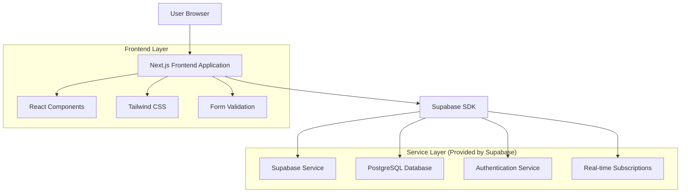
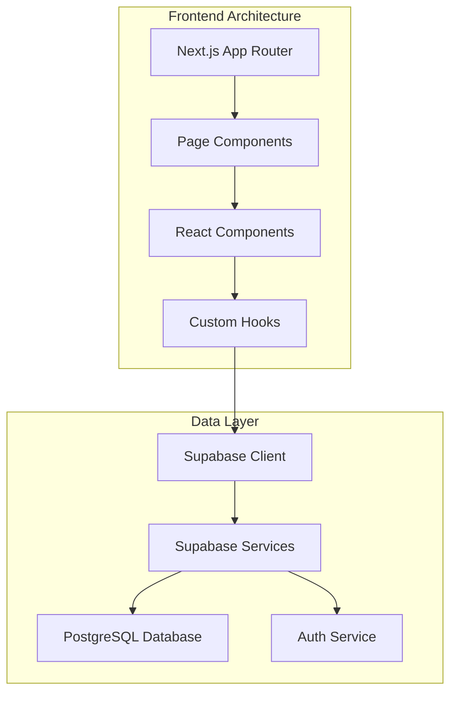
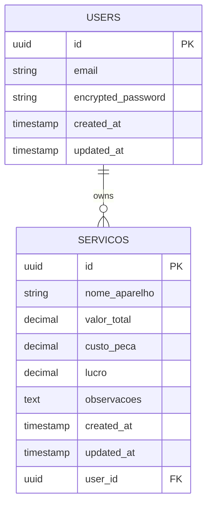

# Arquitetura Técnica - Sistema de Gerenciamento Financeiro

## 1. Architecture design



## 2. Technology Description

* Frontend: Next.js\@14 + React\@18 + TypeScript + Tailwind CSS\@3 + React Hook Form + Zod

* Backend: Supabase (PostgreSQL + Auth + Real-time)

* Deployment: Vercel (Frontend) + Supabase Cloud

## 3. Route definitions

| Route           | Purpose                                                                      |
| --------------- | ---------------------------------------------------------------------------- |
| /               | Página inicial - redireciona para /login ou /dashboard conforme autenticação |
| /login          | Página de login e autenticação de usuários                                   |
| /dashboard      | Dashboard principal com resumo financeiro e navegação                        |
| /servicos/novo  | Formulário para cadastro de novos serviços                                   |
| /servicos       | Lista completa de serviços com filtros e paginação                           |
| /servicos/\[id] | Página de edição de serviço específico                                       |
| /relatorios     | Página de relatórios e estatísticas financeiras                              |
| /perfil         | Configurações do perfil do usuário                                           |

## 4. API definitions

### 4.1 Core API

**Autenticação (Supabase Auth)**

```typescript
// Login
supabase.auth.signInWithPassword({
  email: string,
  password: string
})

// Logout
supabase.auth.signOut()

// Recuperação de senha
supabase.auth.resetPasswordForEmail(email: string)
```

**Serviços CRUD**

```typescript
// Criar serviço
supabase.from('servicos').insert({
  nome_aparelho: string,
  valor_total: number,
  custo_peca: number,
  observacoes?: string,
  user_id: string
})

// Listar serviços
supabase.from('servicos')
  .select('*')
  .eq('user_id', userId)
  .order('created_at', { ascending: false })

// Atualizar serviço
supabase.from('servicos')
  .update(updateData)
  .eq('id', serviceId)
  .eq('user_id', userId)

// Deletar serviço
supabase.from('servicos')
  .delete()
  .eq('id', serviceId)
  .eq('user_id', userId)
```

**Tipos TypeScript**

```typescript
interface Servico {
  id: string;
  nome_aparelho: string;
  valor_total: number;
  custo_peca: number;
  lucro: number; // calculado: valor_total - custo_peca
  observacoes?: string;
  created_at: string;
  updated_at: string;
  user_id: string;
}

interface RelatorioResumo {
  lucro_total: number;
  total_servicos: number;
  ticket_medio: number;
  custo_medio_pecas: number;
}

interface FiltrosPeriodo {
  data_inicio?: string;
  data_fim?: string;
}
```

## 5. Server architecture diagram



## 6. Data model

### 6.1 Data model definition



### 6.2 Data Definition Language

**Tabela de Serviços (servicos)**

```sql
-- Criar tabela de serviços
CREATE TABLE servicos (
    id UUID PRIMARY KEY DEFAULT gen_random_uuid(),
    nome_aparelho VARCHAR(255) NOT NULL,
    valor_total DECIMAL(10,2) NOT NULL CHECK (valor_total >= 0),
    custo_peca DECIMAL(10,2) NOT NULL CHECK (custo_peca >= 0),
    lucro DECIMAL(10,2) GENERATED ALWAYS AS (valor_total - custo_peca) STORED,
    observacoes TEXT,
    created_at TIMESTAMP WITH TIME ZONE DEFAULT NOW(),
    updated_at TIMESTAMP WITH TIME ZONE DEFAULT NOW(),
    user_id UUID REFERENCES auth.users(id) ON DELETE CASCADE
);

-- Criar índices para performance
CREATE INDEX idx_servicos_user_id ON servicos(user_id);
CREATE INDEX idx_servicos_created_at ON servicos(created_at DESC);
CREATE INDEX idx_servicos_lucro ON servicos(lucro DESC);

-- Configurar RLS (Row Level Security)
ALTER TABLE servicos ENABLE ROW LEVEL SECURITY;

-- Política para usuários autenticados acessarem apenas seus próprios dados
CREATE POLICY "Users can view own servicos" ON servicos
    FOR SELECT USING (auth.uid() = user_id);

CREATE POLICY "Users can insert own servicos" ON servicos
    FOR INSERT WITH CHECK (auth.uid() = user_id);

CREATE POLICY "Users can update own servicos" ON servicos
    FOR UPDATE USING (auth.uid() = user_id);

CREATE POLICY "Users can delete own servicos" ON servicos
    FOR DELETE USING (auth.uid() = user_id);

-- Trigger para atualizar updated_at automaticamente
CREATE OR REPLACE FUNCTION update_updated_at_column()
RETURNS TRIGGER AS $$
BEGIN
    NEW.updated_at = NOW();
    RETURN NEW;
END;
$$ language 'plpgsql';

CREATE TRIGGER update_servicos_updated_at 
    BEFORE UPDATE ON servicos 
    FOR EACH ROW 
    EXECUTE FUNCTION update_updated_at_column();

-- Dados iniciais para demonstração (opcional)
INSERT INTO servicos (nome_aparelho, valor_total, custo_peca, observacoes, user_id)
VALUES 
    ('Smartphone Samsung Galaxy', 150.00, 80.00, 'Troca de tela', auth.uid()),
    ('iPhone 12', 300.00, 200.00, 'Reparo da bateria', auth.uid()),
    ('Notebook Dell', 250.00, 120.00, 'Limpeza e troca de pasta térmica', auth.uid())
WHERE auth.uid() IS NOT NULL;
```

**Configurações de Permissões Supabase**

```sql
-- Garantir acesso básico para usuários anônimos (apenas para auth)
GRANT USAGE ON SCHEMA public TO anon;

-- Garantir acesso completo para usuários autenticados
GRANT ALL PRIVILEGES ON TABLE servicos TO authenticated;
GRANT USAGE, SELECT ON ALL SEQUENCES IN SCHEMA public TO authenticated;
```

