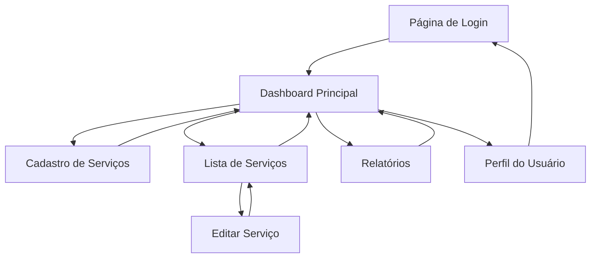

# Sistema de Gerenciamento Financeiro para Assistência Técnica

## 1. Product Overview

Sistema web completo para gerenciamento financeiro de assistência técnica, permitindo cadastro de serviços, controle de custos e cálculo automático de lucros.
O produto resolve a necessidade de pequenos negócios de assistência técnica organizarem suas finanças, controlarem custos de peças e visualizarem a rentabilidade de cada serviço prestado.
Destinado a técnicos e pequenos empresários do setor de assistência técnica que precisam de uma ferramenta simples e eficiente para controle financeiro.

## 2. Core Features

### 2.1 User Roles

| Role | Registration Method | Core Permissions |
|------|---------------------|------------------|
| Técnico/Proprietário | Email e senha via Supabase Auth | Acesso completo: cadastrar, editar, excluir serviços e visualizar relatórios |

### 2.2 Feature Module

Nosso sistema de gerenciamento financeiro consiste nas seguintes páginas principais:

1. **Página de Login**: autenticação de usuário, recuperação de senha.
2. **Dashboard Principal**: visão geral dos lucros, estatísticas rápidas, navegação principal.
3. **Cadastro de Serviços**: formulário de cadastro, validação de dados, cálculo automático de lucro.
4. **Lista de Serviços**: visualização de todos os serviços, filtros por período, ações de editar/excluir.
5. **Relatórios**: visualização de lucro total, gráficos básicos, filtros por data.
6. **Perfil do Usuário**: configurações da conta, alteração de senha.

### 2.3 Page Details

| Page Name | Module Name | Feature description |
|-----------|-------------|---------------------|
| Página de Login | Formulário de Autenticação | Realizar login com email/senha, link para recuperação de senha, redirecionamento após autenticação |
| Página de Login | Recuperação de Senha | Enviar email de recuperação, validar token, redefinir senha |
| Dashboard Principal | Resumo Financeiro | Exibir lucro total do mês, número de serviços realizados, média de lucro por serviço |
| Dashboard Principal | Navegação Rápida | Botões de acesso rápido para cadastrar novo serviço, ver relatórios, listar serviços |
| Dashboard Principal | Serviços Recentes | Listar últimos 5 serviços cadastrados com informações resumidas |
| Cadastro de Serviços | Formulário Principal | Campos para nome do aparelho, valor total, custo da peça, observações |
| Cadastro de Serviços | Cálculo Automático | Calcular e exibir lucro em tempo real (valor total - custo da peça) |
| Cadastro de Serviços | Validação | Validar campos obrigatórios, formatos numéricos, valores positivos |
| Lista de Serviços | Tabela de Serviços | Exibir todos os serviços com paginação, ordenação por data/lucro |
| Lista de Serviços | Filtros | Filtrar por período (data inicial/final), buscar por nome do aparelho |
| Lista de Serviços | Ações | Editar serviço existente, excluir serviço, visualizar detalhes |
| Relatórios | Lucro Total | Calcular e exibir lucro total por período selecionado |
| Relatórios | Estatísticas | Mostrar número total de serviços, ticket médio, custo médio de peças |
| Relatórios | Filtros de Período | Selecionar período personalizado, filtros pré-definidos (mês atual, últimos 30 dias) |
| Perfil do Usuário | Informações da Conta | Exibir email do usuário, data de cadastro |
| Perfil do Usuário | Configurações | Alterar senha, fazer logout da conta |

## 3. Core Process

**Fluxo Principal do Usuário:**

1. **Autenticação**: Usuário acessa a página de login, insere credenciais e é redirecionado para o dashboard
2. **Cadastro de Serviço**: No dashboard, clica em "Novo Serviço", preenche o formulário (nome do aparelho, valor total, custo da peça, observações), o sistema calcula automaticamente o lucro e salva o serviço
3. **Visualização de Serviços**: Usuário pode acessar a lista completa de serviços, aplicar filtros por período ou buscar por nome do aparelho
4. **Relatórios**: Acessa a página de relatórios para visualizar lucro total, estatísticas e análises por período
5. **Gerenciamento**: Pode editar ou excluir serviços existentes conforme necessário

## 4. User Interface Design

### 4.1 Design Style

- **Cores Primárias**: Azul (#3B82F6) para elementos principais, Verde (#10B981) para lucros/valores positivos
- **Cores Secundárias**: Cinza (#6B7280) para textos secundários, Vermelho (#EF4444) para custos/alertas
- **Estilo de Botões**: Botões arredondados (rounded-lg) com sombras suaves, efeitos hover
- **Fontes**: Inter ou system fonts, tamanhos 14px (texto), 16px (labels), 24px+ (títulos)
- **Layout**: Design baseado em cards, navegação superior fixa, sidebar opcional em desktop
- **Ícones**: Lucide React ou Heroicons, estilo outline para consistência

### 4.2 Page Design Overview

| Page Name | Module Name | UI Elements |
|-----------|-------------|-------------|
| Página de Login | Formulário de Autenticação | Card centralizado, campos com bordas arredondadas, botão azul primário, fundo gradiente sutil |
| Dashboard Principal | Resumo Financeiro | Cards com estatísticas, ícones coloridos, valores em destaque com fonte maior |
| Dashboard Principal | Navegação Rápida | Grid de botões com ícones, cores diferenciadas por ação, sombras hover |
| Cadastro de Serviços | Formulário Principal | Layout em coluna única, labels claros, campos com validação visual, botão de salvar destacado |
| Cadastro de Serviços | Cálculo Automático | Campo de lucro em destaque com cor verde, atualização em tempo real |
| Lista de Serviços | Tabela de Serviços | Tabela responsiva, alternância de cores nas linhas, ações com ícones |
| Lista de Serviços | Filtros | Barra de filtros no topo, campos de data side-by-side, botão de aplicar filtros |
| Relatórios | Estatísticas | Cards com métricas, gráficos simples, cores consistentes com o tema |
| Perfil do Usuário | Configurações | Layout simples, campos de formulário, botões de ação claramente separados |

### 4.3 Responsiveness

O produto é desenvolvido com abordagem mobile-first, garantindo experiência otimizada em smartphones e tablets. Inclui navegação touch-friendly com botões de tamanho adequado (mínimo 44px), menus colapsáveis em telas menores e layout adaptativo que reorganiza elementos conforme o tamanho da tela. A tabela de serviços se transforma em cards empilhados em dispositivos móveis para melhor usabilidade.