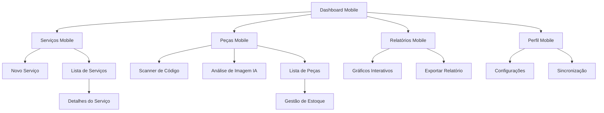

# PRD - Transformação Mobile Native App
## Sistema de Gestão Financeira para Assistência Técnica

## 1. Product Overview
Transformação completa do aplicativo web atual em uma experiência mobile nativa que oferece performance, usabilidade e design equivalentes a aplicativos nativos de smartphone. O objetivo é criar uma interface mobile-first que maximize a produtividade dos técnicos em campo, oferecendo acesso rápido e intuitivo a todas as funcionalidades de gestão de serviços e peças.

- **Problema a resolver**: Interface web atual não otimizada para uso móvel, resultando em baixa produtividade e experiência frustrante em smartphones
- **Público-alvo**: Técnicos de assistência técnica que precisam de acesso móvel rápido e eficiente às funcionalidades do sistema
- **Valor do produto**: Aumentar a produtividade em campo em 40% através de uma interface mobile nativa otimizada

## 2. Core Features

### 2.1 User Roles
| Role | Registration Method | Core Permissions |
|------|---------------------|------------------|
| Técnico | Login com email/senha | Acesso completo a serviços, peças, relatórios e perfil |
| Admin | Acesso administrativo | Todas as permissões + configurações do sistema |

### 2.2 Feature Module
Nossa aplicação mobile nativa consistirá nas seguintes páginas principais:

1. **Dashboard Mobile**: navegação por cards, métricas visuais, acesso rápido às funcionalidades principais
2. **Serviços Mobile**: lista otimizada para touch, formulários mobile-friendly, busca por voz
3. **Peças Mobile**: scanner de código de barras, análise de imagem com IA, gestão de estoque touch-first
4. **Relatórios Mobile**: gráficos interativos otimizados para mobile, exportação simplificada
5. **Perfil Mobile**: configurações acessíveis, modo offline, sincronização automática

### 2.3 Page Details

| Page Name | Module Name | Feature description |
|-----------|-------------|---------------------|
| Dashboard Mobile | Cards de Navegação | Exibir cards grandes e tocáveis para acesso rápido às principais funcionalidades |
| Dashboard Mobile | Métricas Visuais | Mostrar indicadores de performance com gráficos otimizados para tela pequena |
| Dashboard Mobile | Ações Rápidas | Botões flutuantes para criar novo serviço ou registrar peça rapidamente |
| Serviços Mobile | Lista Touch-Optimized | Lista de serviços com swipe actions, pull-to-refresh, scroll infinito |
| Serviços Mobile | Formulário Mobile | Campos otimizados para teclado móvel, validação em tempo real, auto-complete |
| Serviços Mobile | Busca Inteligente | Busca por voz, filtros deslizantes, resultados instantâneos |
| Peças Mobile | Scanner Integrado | Leitura de código de barras nativa, análise de imagem com IA do Gemini |
| Peças Mobile | Gestão Touch-First | Interface de arrastar e soltar, gestos de swipe para ações |
| Peças Mobile | Modo Offline | Sincronização automática quando conectado, cache inteligente |
| Relatórios Mobile | Gráficos Interativos | Charts responsivos com gestos de zoom e pan, animações suaves |
| Relatórios Mobile | Exportação Simplificada | Compartilhamento nativo do sistema, formatos otimizados |
| Perfil Mobile | Configurações Acessíveis | Interface de configurações nativa, toggle switches, sliders |
| Perfil Mobile | Sincronização | Status de sync em tempo real, resolução de conflitos automática |

## 3. Core Process

**Fluxo Principal do Técnico Mobile:**
O técnico acessa o dashboard mobile e visualiza cards grandes com as principais ações. Para registrar um novo serviço, toca no botão flutuante, preenche o formulário otimizado para mobile com validação em tempo real. Para adicionar peças, usa o scanner integrado ou análise de imagem com IA. Todas as ações têm feedback visual imediato e animações suaves.

**Fluxo de Gestão de Peças Mobile:**
O técnico acessa a seção de peças, usa pull-to-refresh para atualizar a lista, pode usar swipe actions para editar ou excluir. Para adicionar novas peças, usa o scanner de código de barras ou fotografa a nota fiscal para análise automática com IA.

## 4. User Interface Design

### 4.1 Design Style
- **Cores primárias**: #007AFF (iOS Blue), #1976D2 (Material Blue) - adaptável ao sistema
- **Cores secundárias**: #34C759 (Success), #FF3B30 (Error), #FF9500 (Warning)
- **Estilo de botões**: Rounded corners (12px), elevation shadows, ripple effects
- **Tipografia**: SF Pro (iOS) / Roboto (Android), tamanhos 14px-24px otimizados para legibilidade móvel
- **Layout**: Card-based design, bottom navigation, floating action buttons
- **Ícones**: SF Symbols (iOS) / Material Icons (Android), outline style, 24px padrão
- **Animações**: Easing curves nativas, duração 200-300ms, spring animations para feedback

### 4.2 Page Design Overview

| Page Name | Module Name | UI Elements |
|-----------|-------------|-------------|
| Dashboard Mobile | Cards de Navegação | Cards com elevation 4dp, corner radius 16px, ícones 48px, tipografia Headline 6 |
| Dashboard Mobile | Bottom Navigation | 5 tabs com ícones outline, active state com cor primária, badge notifications |
| Serviços Mobile | Lista Touch-Optimized | List items 72dp altura, dividers 1dp, swipe actions com ícones 24px |
| Serviços Mobile | Floating Action Button | FAB 56dp, cor primária, ícone add 24px, elevation 6dp |
| Peças Mobile | Scanner Interface | Overlay com cantos arredondados, botões circulares 48dp, feedback haptic |
| Peças Mobile | Cards de Peças | Cards 2-column grid, imagens 16:9, texto truncado com ellipsis |
| Relatórios Mobile | Gráficos | Charts responsivos, cores acessíveis, gestos de zoom, loading skeletons |
| Perfil Mobile | Lista de Configurações | List items com switches, dividers, ícones leading 24px, chevron trailing |

### 4.3 Responsiveness
**Mobile-First Design**: Interface projetada primariamente para smartphones (320px-428px), com adaptação progressiva para tablets (768px+). Otimização completa para touch interaction com áreas de toque mínimas de 44px, gestos nativos implementados, e suporte a orientação portrait/landscape com layouts adaptativos.

## 5. Funcionalidades Mobile Nativas

### 5.1 Gestos e Interações
- **Swipe Actions**: Deslizar para editar/excluir em listas
- **Pull-to-Refresh**: Atualização de dados com gesto nativo
- **Scroll Infinito**: Carregamento progressivo de conteúdo
- **Pinch-to-Zoom**: Zoom em gráficos e imagens
- **Long Press**: Menu contextual para ações secundárias
- **Haptic Feedback**: Vibração sutil para confirmação de ações

### 5.2 Performance e Otimização
- **Lazy Loading**: Carregamento sob demanda de componentes
- **Code Splitting**: Divisão do código por rotas
- **Image Optimization**: Compressão e formatos modernos (WebP)
- **Service Worker**: Cache inteligente para modo offline
- **Virtual Scrolling**: Listas grandes com performance otimizada
- **60fps Target**: Animações e transições suaves

### 5.3 Acessibilidade Mobile
- **Screen Reader**: Suporte completo a VoiceOver/TalkBack
- **High Contrast**: Modo de alto contraste automático
- **Font Scaling**: Suporte a tamanhos de fonte do sistema
- **Voice Control**: Navegação por comandos de voz
- **Keyboard Navigation**: Suporte a teclados externos
- **Focus Management**: Indicadores visuais claros de foco